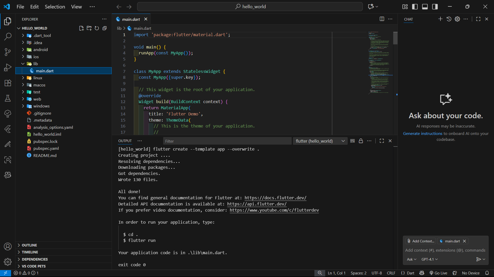
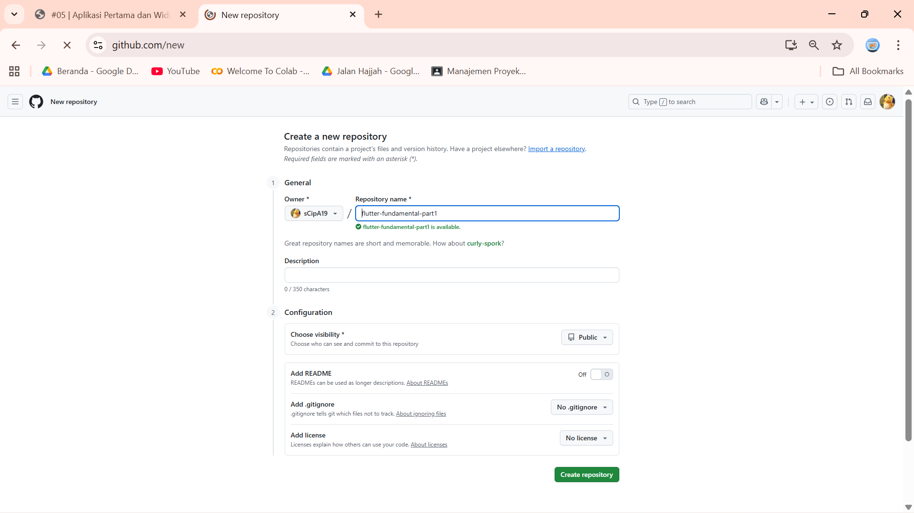

<div align="center">

# LAPORAN PRAKTIKUM PEMOGRAMAN MOBILE

### JOBSHEET 5
### APLIKASI PERTAMA DAN WIDGET DASAR FLUTTER

<p align="center">
  
  
</p>

---

### Nama  : Syifa Revalina Kamila
### NIM   : 2341760041
### Kelas : SIB 3C

---

## PROGRAM STUDI SISTEM INFORMASI BISNIS
### JURUSAN TEKNOLOGI INFORMASI
### POLITEKNIK NEGERI MALANG
### 2025/2026

</div>

---

## Praktikum 1: Membuat Project Flutter Baru

1. Buka **VS Code**, lalu tekan tombol **Ctrl + Shift + P** untuk membuka *Command Palette*.
   Ketik **Flutter**, kemudian pilih **New Application Project**.
   <p align="center"></p>

2. Buat folder sesuai style laporan praktikum yang Anda pilih. Disarankan pada folder **Dokumen** atau **Desktop**.
   <p align="center"></p>

3. Buat nama project Flutter **hello_world**, lalu tekan **Enter**. Tunggu hingga proses pembuatan selesai.
   <p align="center"></p>

4. Jika sudah selesai, akan muncul pesan **"Your Flutter Project is ready!"** yang artinya project Flutter berhasil dibuat.
   <p align="center"></p>

---

## Praktikum 2: Menghubungkan Perangkat Android atau Emulator


---

## Praktikum 3: Membuat Repository GitHub dan Laporan Praktikum

1. Login ke akun **GitHub**, lalu buat repository baru dengan nama `flutter-fundamental-part1`.
   <p align="center"></p>

2. Klik **Create repository**, maka akan tampil halaman repository baru.
   <p align="center"></p>

3. Kembali ke VS Code pada project `hello_world`, buka terminal (**Terminal > New Terminal**) lalu ketik:

   ```bash
   git init
4. Pilih menu Source Control di bagian kiri, lalu lakukan stages (+) pada file .gitignore untuk mengunggah file pertama ke repository GitHub.
5. **Commit dan Push ke Repository GitHub**
Setelah melakukan *stage* pada file `.gitignore`:
1. Beri pesan commit **"tambah gitignore"** lalu klik **Commit (✔)**.
    <p align="center"></p>
2. Lakukan **Push** melalui menu titik tiga > **Push**.
    <p align="center"></p>
3. Pada pojok kanan bawah, akan muncul notifikasi **Add Remote** → klik tombol tersebut.
    <p align="center"></p>
4. Salin tautan repository GitHub dari browser, lalu paste pada bagian **Add Remote** dan beri nama remote **origin**.
    <p align="center"></p>
    <p align="center"></p>


