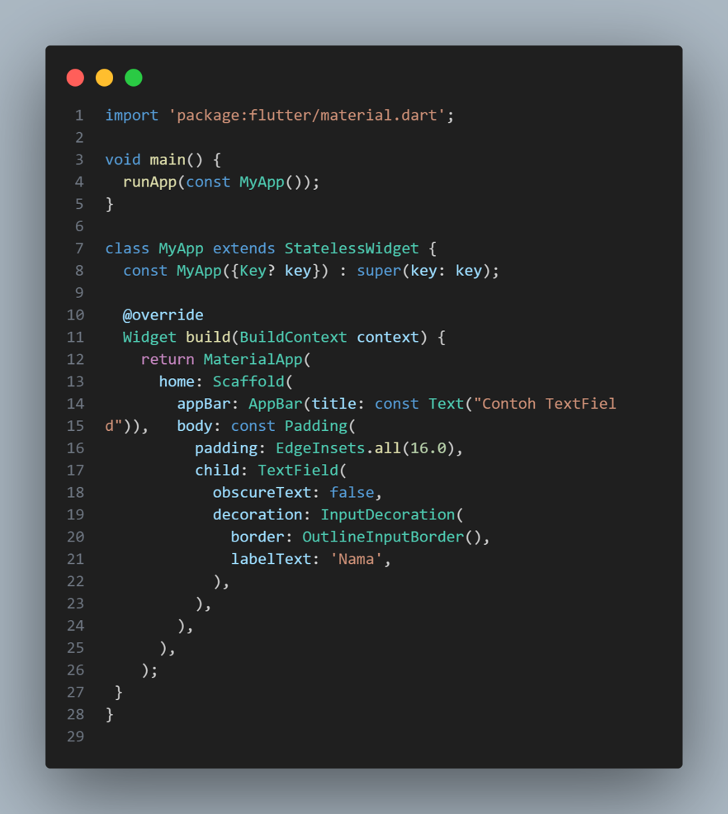

<div align="center">

# LAPORAN PRAKTIKUM PEMOGRAMAN MOBILE

### JOBSHEET 5
### APLIKASI PERTAMA DAN WIDGET DASAR FLUTTER

<p align="center">
  
  
</p>

---

### Nama  : Syifa Revalina Kamila
### NIM   : 2341760041
### Kelas : SIB 3C

---

## PROGRAM STUDI SISTEM INFORMASI BISNIS
### JURUSAN TEKNOLOGI INFORMASI
### POLITEKNIK NEGERI MALANG
### 2025/2026

</div>

---

## Praktikum 1: Membuat Project Flutter Baru

1. Buka **VS Code**, lalu tekan tombol **Ctrl + Shift + P** untuk membuka *Command Palette*.
   Ketik **Flutter**, kemudian pilih **New Application Project**.
   <p align="center"></p>

2. Buat folder sesuai style laporan praktikum yang Anda pilih. Disarankan pada folder **Dokumen** atau **Desktop**.
   <p align="center"></p>

3. Buat nama project Flutter **hello_world**, lalu tekan **Enter**. Tunggu hingga proses pembuatan selesai.
   <p align="center"></p>

4. Jika sudah selesai, akan muncul pesan **"Your Flutter Project is ready!"** yang artinya project Flutter berhasil dibuat.
   <p align="center"></p>

---

## Praktikum 2: Menghubungkan Perangkat Android atau Emulator
1. Masuk ke menu informasi perangkat lunak di pengaturan ponsel Android, lalu ketuk bagian tersebut tujuh kali hingga muncul pop-up yang menyatakan bahwa Anda sekarang menjadi developer.
   <p align="center"></p>
   <p align="center"></p>
2. Setelah berhasil masuk ke menu Sistem, buka opsi Developer. Kemudian cari dan pilih USB debugging, lalu aktifkan mode debugging setelah perangkat tersambung melalui USB.
   <p align="center"></p>
   <p align="center"></p>

---

## Praktikum 3: Membuat Repository GitHub dan Laporan Praktikum

1. Login ke akun **GitHub**, lalu buat repository baru dengan nama `flutter-fundamental-part1`.
   <p align="center"></p>

2. Klik **Create repository**, maka akan tampil halaman repository baru.
   <p align="center"></p>

3. Kembali ke VS Code pada project `hello_world`, buka terminal (**Terminal > New Terminal**) lalu ketik:

   ```bash
   git init
4. Pilih menu Source Control di bagian kiri, lalu lakukan stages (+) pada file .gitignore untuk mengunggah file pertama ke repository GitHub.
5. **Commit dan Push ke Repository GitHub**
Setelah melakukan *stage* pada file `.gitignore`:
1. Beri pesan commit **"tambah gitignore"** lalu klik **Commit (✔)**.
    <p align="center"></p>
2. Lakukan **Push** melalui menu titik tiga > **Push**.
    <p align="center"></p>
3. Pada pojok kanan bawah, akan muncul notifikasi **Add Remote** → klik tombol tersebut.
    <p align="center"></p>
4. Salin tautan repository GitHub dari browser, lalu paste pada bagian **Add Remote** dan beri nama remote **origin**.
    <p align="center"></p>
    <p align="center"></p>
5. Setelah proses push berhasil, masukkan username GitHub Anda dan token personal sebagai pengganti password biasa saat login di GitHub melalui browser. Setelah itu, lakukan reload pada halaman repository GitHub, dan Anda akan melihat hasil push kedua file tersebut muncul seperti pada gambar berikut.
    <p align="center"></p>
6. Lakukan push juga untuk semua file lainnya dengan pilih Stage All Changes. Beri pesan commit "project hello_world". Maka akan tampil di repository GitHub Anda seperti berikut.
    <p align="center"></p>
7. Kembali ke VS Code, ubah terlebih dahulu platform pada bagian kanan bawah menjadi emulator, perangkat fisik, atau dapat juga memilih browser Chrome. Setelah itu, jalankan project hello_world dengan menekan tombol F5 atau melalui menu Run > Start Debugging. Tunggu hingga proses kompilasi selesai, dan aplikasi Flutter pertama Anda akan muncul seperti contoh berikut.
    <p align="center"></p>

---

## Praktikum 4: Menerapkan Widget Dasar
## Langkah 1: Text Widget
Buat folder baru **basic_widgets** di dalam folder lib. Kemudian buat file baru di dalam **basic_widgets** dengan nama **text_widget.dart**. Ketik atau salin kode program berikut ke project **hello_world** Anda pada file **text_widget.dart**.
    <p align="center"></p>
Lakukan import file text_widget.dart ke main.dart, lalu ganti bagian text widget dengan kode di atas. Maka hasilnya seperti gambar berikut. Screenshot hasil milik Anda, lalu dibuat laporan pada file README.md.
    <p align="center"></p>
## Langkah 2: Image Widget
Buat sebuah file image_widget.dart di dalam folder basic_widgets dengan isi kode berikut.
    <p align="center"></p>
    <p align="center"></p>
Jangan lupa sesuaikan kode dan import di file main.dart kemudian akan tampil gambar seperti berikut.
    <p align="center"></p>

---

## Praktikum 5: Menerapkan Widget Material Design dan iOS Cupertino
## Langkah 1: Cupertino Button dan Loading Bar
Buat file di basic_widgets > loading_cupertino.dart. Import stateless widget dari material dan cupertino. Lalu isi kode di dalam method Widget build adalah sebagai berikut.
    <p align="center"></p>
## Langkah 2: Floating Action Button (FAB)
Buat file di basic_widgets > fab_widget.dart. Import stateless widget dari material. Lalu isi kode di dalam method Widget build adalah sebagai berikut.
    <p align="center"></p>
## Langkah 3: Scaffold Widget
Ubah isi kode main.dart seperti berikut.
    <p align="center"></p>
## Langkah 4: Dialog Widget
Ubah isi kode main.dart seperti berikut.
    <p align="center"></p>
    <p align="center"></p>
## Langkah 5: Input dan Selection Widget
Contoh penggunaan TextField widget adalah sebagai berikut:
    <p align="center"></p>
    <p align="center"></p>
## Langkah 6: Date and Time Pickers
Date and Time Pickers termasuk pada kategori input dan selection widget, berikut adalah contoh penggunaan Date and Time Pickers.
    <p align="center"></p>
    <p align="center"></p>
    <p align="center"></p>

---


