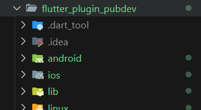
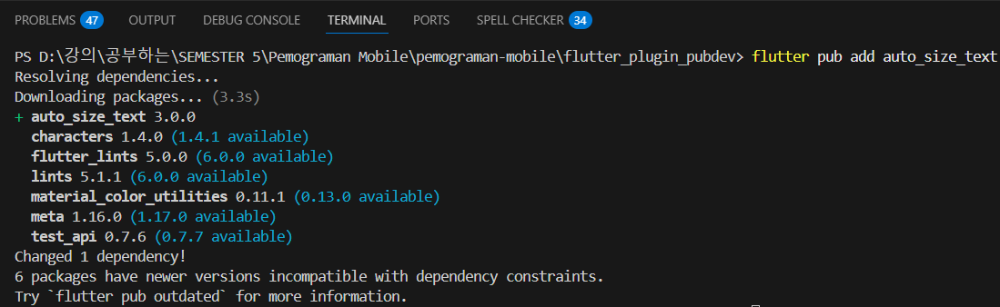
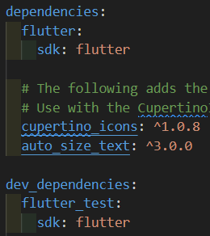
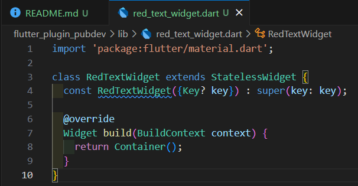
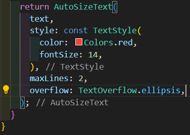
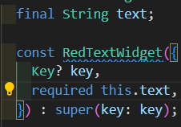
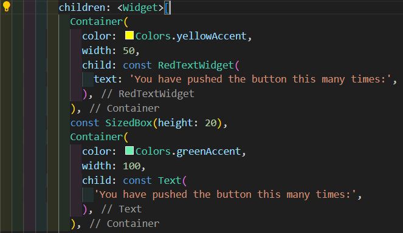
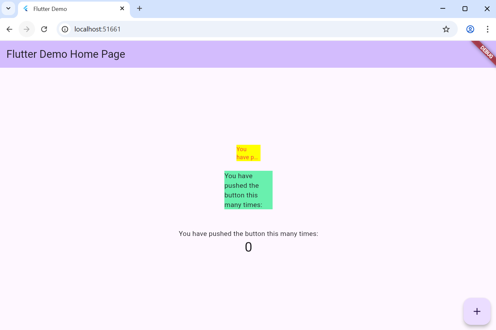

# LAPORAN PRAKTIKUM PEMOGRAMAN MOBILE
### JOBSHEET 6
### Layout dan Navigasi

  
  

---

### Nama  : Syifa Revalina Kamila
### NIM   : 2341760041
### Kelas : SIB 3C

---

## PROGRAM STUDI SISTEM INFORMASI BISNIS
### JURUSAN TEKNOLOGI INFORMASI
### POLITEKNIK NEGERI MALANG
### 2025/2026

---

## Langkah 1: Buat Project Baru
Buatlah sebuah project flutter baru dengan nama flutter_plugin_pubdev.
    

## Langkah 2: Menambahkan Plugin
Tambahkan plugin auto_size_text menggunakan perintah berikut di terminal
    

- Langkah ini digunakan untuk menambahkan plugin eksternal dari Pub.dev ke proyek Flutter.
- Plugin auto_size_text berfungsi untuk mengatur ukuran teks secara otomatis agar muat di dalam area tampilan (container) tanpa meluap.
Jika berhasil, maka akan tampil nama plugin beserta versinya di file pubspec.yaml pada bagian dependencies.
    

Artinya proyek sekarang memiliki dependensi eksternal yang bisa digunakan di dalam widget.
## Langkah 3: Buat file red_text_widget.dart
Buat file baru bernama red_text_widget.dart di dalam folder lib lalu isi kode seperti berikut.
    

## Langkah 4: Tambah Widget AutoSizeText
Masih di file red_text_widget.dart, untuk menggunakan plugin auto_size_text, ubahlah kode return Container() menjadi seperti berikut.
    

## Langkah 5: Buat Variabel text dan parameter di constructor
Tambahkan variabel text dan parameter di constructor seperti berikut.
    

- final String text; → membuat variabel untuk menyimpan teks yang akan ditampilkan.
- required this.text → menjadikan parameter text wajib diisi ketika memanggil widget ini.
## Langkah 6: Tambahkan widget di main.dart
Buka file main.dart lalu tambahkan di dalam children: pada class _MyHomePageState
    

🟥 RedTextWidget
- Menggunakan plugin AutoSizeText.
- Teks akan otomatis mengecil ukurannya agar tetap muat dalam lebar container yang sempit (50 px).
- Jika teks terlalu panjang, bagian yang tidak muat akan diganti dengan “...” (karena overflow: TextOverflow.ellipsis).
- Warna teks merah (Colors.red).

🟩 Text
- Widget bawaan Flutter untuk menampilkan teks tanpa auto resize.
- Jika teks terlalu panjang, bisa terpotong atau meluap keluar area container.
- Warna teks default (hitam).

## Hasil

