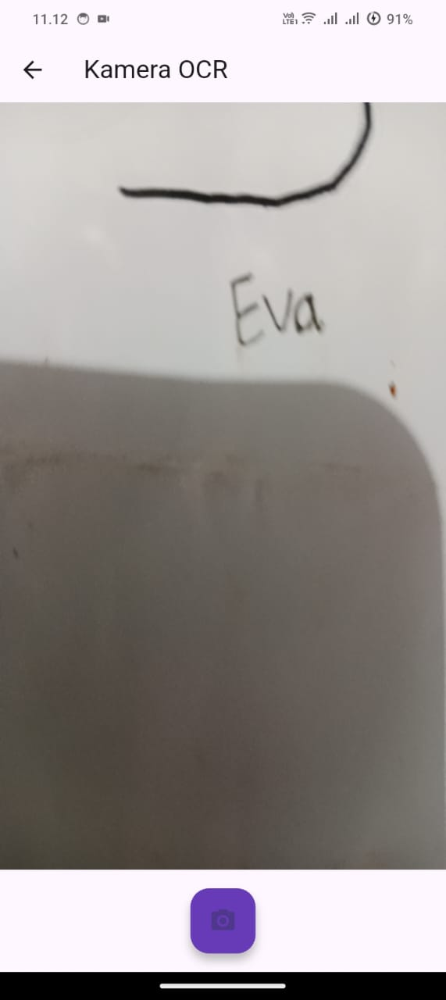
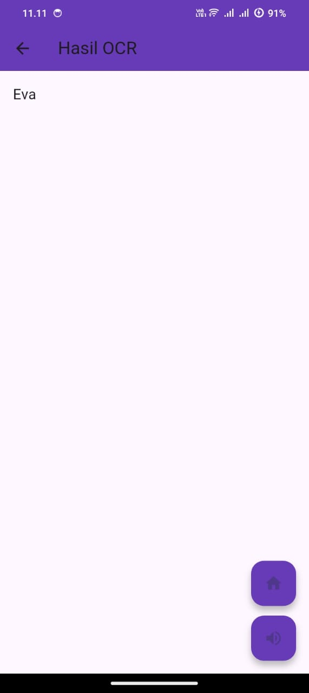

# LAPORAN PRAKTIKUM PEMOGRAMAN MOBILE
### JOBSHEET 6
### Layout dan Navigasi

  
  

---

### Nama  : Syifa Revalina Kamila
### NIM   : 2341760041
### Kelas : SIB 3C

---

## PROGRAM STUDI SISTEM INFORMASI BISNIS
### JURUSAN TEKNOLOGI INFORMASI
### POLITEKNIK NEGERI MALANG
### 2025/2026

## Hasil
1. Tampilan Menu Utama aplikasi OCR sederhana dengan tombol “Mulai Scan Teks” untuk menuju ke halaman kamera.
   

2. Halaman Kamera OCR yang digunakan untuk mengambil gambar berisi teks agar dapat diproses menggunakan metode OCR.
   

3. Buatlah sebuah project flutter baru dengan nama layout_flutter. Atau sesuaikan style laporan praktikum yang Anda buat.
   

4. Selanjutnya bisa mendengarkan hasil suara dari teks yang terdeteksi melalui video berikut:
    🎥 [Klik di sini untuk melihat video hasil OCR](./images/video.mp4)

